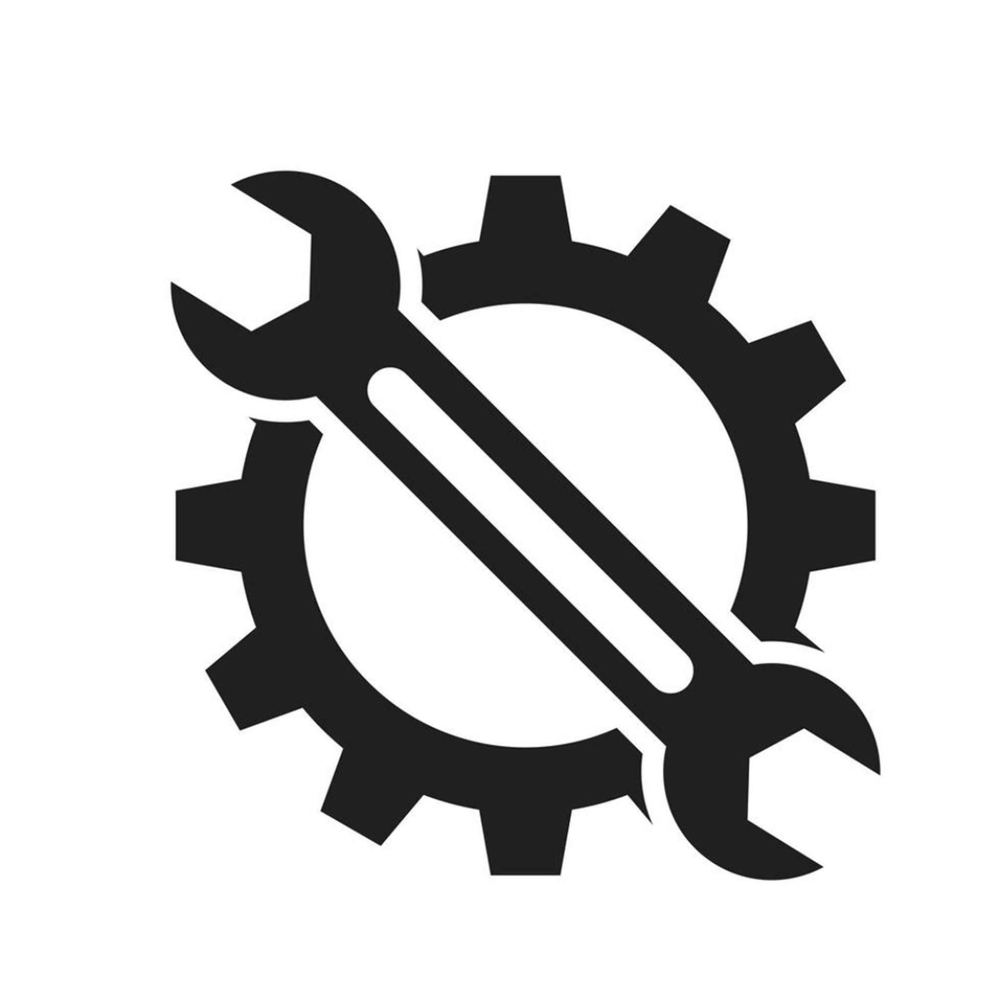

<p align="center">
  
</p>

<h1 align="center">GameMaster</h1>
<p align="center">Advanced iOS Game Tool</p>

<p align="center">
  A powerful game tool for iOS, designed for <b>non-jailbroken</b> devices via sideloading (IPA injection).
</p>

<p align="center"><i>Created by tinysweet</i></p>

---

## Features

### Memory Search
- **Exact Search** — find specific values in memory
- **Range Search** — find values within min-max range
- **Fuzzy Search** — track value changes (increased/decreased/unchanged)
- **Nearby Search** — find related values close in memory (still bug)
- Supports: Int8, UInt8, Int16, UInt16, Int32, UInt32, Int64, UInt64, Float, Double
- Inline Edit, Freeze, Save, Watch buttons per result
- Select All + Batch Write/Freeze/Save/Watch

### Value Manager
- Read/write values at saved addresses
- Value Lock (freeze) at ~60fps
- Select All + Delete Selected
- Per-row Edit, Lock, Delete buttons

### Speed Hack
- Hook modes: gettimeofday, clock_gettime, mach_absolute_time, Unity timeScale
- Speed range: 0.1x - 1000x with presets + custom input
- Based on [LuckySpeeder](https://github.com/kekeimiku/LuckySpeeder) approach
- Uses `os_unfair_lock` for thread safety

### Debugger
- **Watchpoints** — monitor memory addresses for writes (software polling @100Hz)
- **Live Offset Patcher** — patch ARM64 instructions at offsets
- NOP / RET helper buttons
- Save patches as toggleable items (persisted to disk)

### Il2Cpp Dumper
- Auto-detect Unity il2cpp games
- Dump all classes, methods, fields, properties
- Output: dump.cs, Assembly headers, script.json, ida.py, ida_py3.py
- Real-time progress log
- Based on [IOS-Il2CppDumper](https://github.com/tien0246/IOS-Il2CppDumper)

### Info
- Shows injection details, process info, device info
- Creator: tinysweet

---

## Building

```bash
cd GameMaster
make clean && make
```

## Injection

Use tool like esign, ksign, any app that have option for inject deb or dylib

Then sideload with AltStore/Sideloadly/TrollStore.

---

## Credits
- [fishhook](https://github.com/facebook/fishhook) by Meta — BSD License
- [LuckySpeeder](https://github.com/kekeimiku/LuckySpeeder) by kekeimiku — MIT License
- [IOS-Il2CppDumper](https://github.com/tien0246/IOS-Il2CppDumper) — il2cpp dump engine
- [nlohmann/json](https://github.com/nlohmann/json) — MIT License
